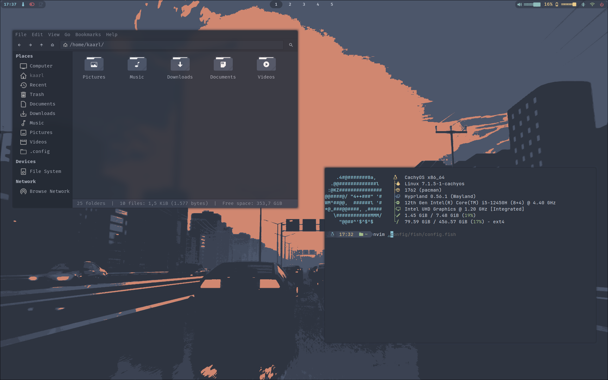

# dotk — dotfiles

Personal configuration files for Hyprland (uwsm-managed), Waybar, GTK, and related tools on Arch Linux.



## What's included

| Directory | Description |
|-----------|-------------|
| `hypr/` | Hyprland WM config (Lua DSL) — general, keybinds, window rules, hyprlock, hypridle, hyprpaper |
| `waybar/` | Status bar — Nord theme, steam widget |
| `uwsm/` | Universal Wayland Session Manager env vars |
| `power-menu/` | Nord-themed rofi power menu (suspend / reboot / shutdown / logout) |
| `fastfetch/` | System info display with custom ASCII art |
| `ohmyposh/` | Shell prompt theme (Nord) |
| `wallpapers/` | Wallpaper collection |
| `gtk-3.0/` & `gtk-4.0/` | GTK theme (Nordic-darker), Tela-circle-nord icons |
| `qt5ct/` & `qt6ct/` | Qt theme (Kvantum, same Nord palette) |
| `dunst/` | Notification daemon |
| `rofi/` | Application launcher |
| `alacritty/` | Terminal emulator |
| `fish/` | Shell config (sources Oh My Posh) |
| `btop/` | System monitor with Nord theme |
| `swayosd/` | On-screen display (volume/brightness) |

## Dependencies

- **WM**: Hyprland, uwsm
- **Bar**: waybar (with mpris support)
- **Theming**: Nordic-darker GTK theme, Tela-circle-nord icon theme, Kvantum
- **Fonts**: FiraCode Nerd Font, JetBrainsMono Nerd Font, RecMonoLinear Nerd Font
- **Shell**: fish, oh-my-posh
- **Utils**: fastfetch, dunst, rofi, alacritty, btop, swayosd, hyprlock, hypridle, hyprpaper, playerctl, pulseaudio (pipewire), blueman
- **Other**: power-profiles-daemon, swayosd, networkmanager

## Installation

```bash
# Clone the repo
git clone https://github.com/kallsssss/dotk.git ~/dotk

# Install dependencies, back up existing configs, and install
cd ~/dotk
./install.sh
```

The installer:
- Installs all dependencies via pacman (AUR theming packages via paru/yay if present)
- Asks to back up existing configs to `*.bak-<timestamp>` before copying
- Auto-detects your monitor and replaces the hardcoded `eDP-1` / `1920x1200@60` values
  (or pass `--monitor HDMI-A-1 --mode 2560x1440@144` explicitly)
- Swaps the wifi interface in the waybar config if it differs from `wlan0`
- Makes all scripts executable

Options: `--skip-deps`, `--no-backup`, `--monitor NAME`, `--mode WxH@R`, `--yes`, `--help`

Or copy manually:

```bash
cp ~/dotk/config/hypr/* ~/.config/hypr
cp ~/dotk/config/waybar/* ~/.config/waybar
# ... etc for each directory in config/
```

## Notes

- Hyprland config uses Lua (not hyprlang)
- Monitor default is `eDP-1` at 1920×1200, keyboard layout is `fi` (modify in config/hypr/general.lua)
- `gtk-4.0/gtk.css` and `gtk-dark.css` are symlinks to the installed Nordic-darker theme
